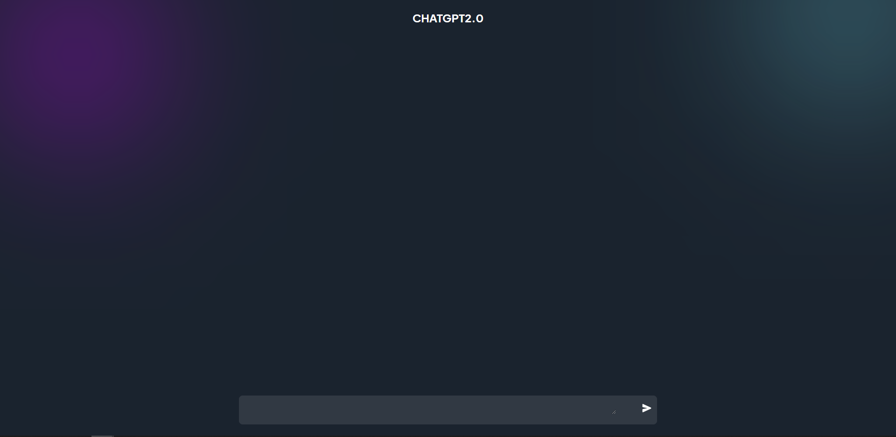

# chatGPT2

## Description 
This application is a clone of chatGPT bot using OpenAI API, React

## Table of Contents
- [Instructions](#instructions)
- [Usage Information](#usage-information)
- [Deploy Link](#deploy-link)
- [Built With](#built-with)
- [Question](#question)

## Instructions
- clone this repository.
- Download Node.js at [https://nodejs.org/en/download/](https://nodejs.org/en/download/)
- Use npm to install required node modules in both server and client by using **npm install** in the command line in each folder.

## Usage Information
- Navigate to server folder and start server by Run `npm run start` in the command line 
- Navigate to client folder and type `npm run dev` in the command line 

## Deploy Link
🚀The application has been deployed to Heroku and the URL of the deployed application is:
[https://van-chatgpt2.herokuapp.com/](https://van-chatgpt2.herokuapp.com/)

## Built With
- OpenAI API
- Express.js
- React

## Question
If you have any additional questions about this project, Feel free to reach me at [vantam8300@gmail.com](vantam8300@gmail.com).
For more of my project, please visit [https://github.com/vantam8300](https://github.com/vantam8300)